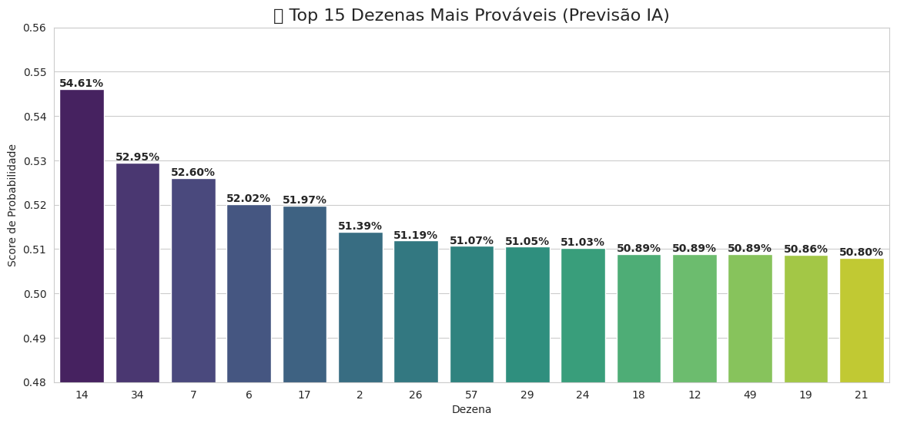

# Análise Preditiva: Mega da Virada com Machine Learning

Este projeto aplica técnicas de Ciência de Dados e algoritmos de Machine Learning para identificar padrões estatísticos nos sorteios históricos da Mega-Sena, com foco na **Mega da Virada**.

  

## Objetivo
Demonstrar como modelos de classificação (**Random Forest**) podem ser usados para calcular a probabilidade de ocorrência de eventos estocásticos baseando-se em variáveis de **Recência** (Atraso) e **Frequência**.

## 🛠️ Tecnologias Utilizadas
* **Python** (Linguagem principal)
* **Pandas** (Manipulação e limpeza de dados)
* **Scikit-Learn** (Criação e treinamento do modelo Random Forest)
* **Matplotlib/Seaborn** (Visualização de dados)

## Metodologia (CRISP-DM)
1.  **Coleta:** Dados de todos os concursos desde 1996.
2.  **Engenharia de Features:** Criação de séries temporais para medir o "Atraso" e o "Momentum" de cada dezena.
3.  **Modelagem:** Treinamento com janelas deslizantes (Sliding Windows) para prever o próximo sorteio com base no anterior.
4.  **Otimização:** Filtros estatísticos (Soma de Gauss e Paridade) aplicados às probabilidades geradas pela IA.

## Como Executar
1. Clone este repositório.
2. Certifique-se de ter o arquivo `mega_sena-1.csv` na pasta raiz.
3. Execute o notebook `Mega_Sena_Prediction_RandomForest.ipynb` no Jupyter ou Google Colab.

## Resultados
O modelo identificou que a dezena **34** possui alta probabilidade devido à sua combinação de recência média e alta frequência histórica em sorteios especiais.

> **Disclaimer:** Este projeto tem fins estritamente educacionais e de portfólio. Não garante ganhos em loterias reais. Jogue com responsabilidade.

---
**Autor:** [Jadson Chagas](https://www.linkedin.com/in/jadson-chagas/)
